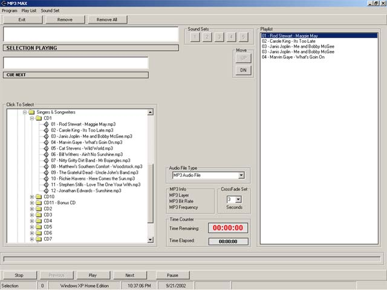



## Audio Max \(Like Raduga\)

### Description

This is a project I started months ago, almost a year, and finished to the best of my abilities at the time. It works completely, with just a few kinks (load time for large folders of MP3's, etc). I hope some of the coding comes in handy for some users out there, some code came from PSC, sorry if you recognize your code, but I wasn't planning on selling this or anything. So here it is, a sound system for your computer for doing music and adding sub sounds with LOTS of really good code involved. Has crossfading timer and all....
 
### More Info
 
Just use the built in browser to load up MP3's and let em rock...

None known

             |
---                |---
**Submitted On**   |2002-09-21 22:34:30
**By**             |[M1K3](https://github.com/Planet-Source-Code/PSCIndex/blob/master/ByAuthor/m1k3.md)
**Level**          |Intermediate
**User Rating**    |4.5 (18 globes from 4 users)
**Compatibility**  |VB 6\.0
**Category**       |[Complete Applications](https://github.com/Planet-Source-Code/PSCIndex/blob/master/ByCategory/complete-applications__1-27.md)
**World**          |[Visual Basic](https://github.com/Planet-Source-Code/PSCIndex/blob/master/ByWorld/visual-basic.md)
**Archive File**   |[Audio\_Max\_1343689212002\.zip](https://github.com/Planet-Source-Code/m1k3-audio-max-like-raduga__1-39174/archive/master.zip)

### API Declarations

See the modules...

